# RAG-MCP: Mitigating Prompt Bloat in LLM Tool Selection via Retrieval-Augmented Generation

Package to build MCP server which applies retrieval augmented generation (RAG) principles to tool selection. Instead of flooding the LLM with all MCP descriptions, we maintain an external vector index of all available MCP metadata.

## Key Points from Research Paper

### Problem Statement
- **Prompt Bloat**: As the number of available tools (MCPs) grows, including all their descriptions in a single prompt leads to context window saturation and poor tool selection
- **Decision Complexity**: LLMs struggle with choosing the correct tool when presented with many similar options
- **Performance Degradation**: Tool selection accuracy drops from >90% with few tools to ~13.62% with many tools

### RAG-MCP Solution
RAG-MCP applies Retrieval-Augmented Generation principles to tool selection:

1. **Retrieval Phase**: A lightweight retriever encodes the user query and performs semantic search over the MCP index, returning top-k candidate MCPs
2. **Validation Phase**: For each retrieved MCP, can generate few-shot examples to test compatibility
3. **Invocation Phase**: Only the single best MCP description is injected into the LLM prompt

### Key Benefits
- **Reduced Prompt Size**: Cuts prompt tokens by over 50% (from 2133.84 to 1084 tokens)
- **Improved Accuracy**: More than triples tool selection accuracy (43.13% vs 13.62% baseline)
- **Lower Cognitive Load**: LLM no longer needs to sift through hundreds of distractors
- **Resource Efficiency**: Only activates the selected MCP server, not all registered ones
- **Extensibility**: New tools can be added to the index without retraining the LLM

### Experimental Results
The MCP stress test shows:
- High success rates (>90%) when candidate pool is small (<30 MCPs)
- Performance degradation becomes significant beyond ~100 MCPs
- RAG-MCP maintains better performance even with large tool registries

### Architecture Overview
RAG-MCP operates in three core steps:
1. User query → Encoded and submitted to retriever
2. Retriever → Searches vector index, ranks candidates by semantic similarity
3. LLM → Receives only selected MCP schema and executes task

### RAG-MCP Pipeline Diagram

```mermaid
graph LR
    A[Query<br/>Encoding] --> B[Vector Search<br/>& Validation]
    B --> C[LLM<br/>Invocation]
    
    A1[User Query] --> A
    A --> A2[Qwen Retriever]
    
    B1[Vector Index] --> B
    B --> B2[Top-k MCPs]
    
    C --> C1[Use selected MCP]
    C --> C2[f&#40;&#41;]
    
    style A fill:#f9f,stroke:#333,stroke-width:2px
    style B fill:#bbf,stroke:#333,stroke-width:2px
    style C fill:#bfb,stroke:#333,stroke-width:2px
```



The pipeline demonstrates how RAG-MCP:
1. **Encodes** user queries with Qwen-max retriever
2. **Retrieves & validates** top-k MCPs from the vector index
3. **Invokes** the chosen MCP with the LLM using only the selected tool's schema

## Goal

The main goal is to enable LLMs to effectively utilize large numbers of external tools without suffering from prompt bloat or decision fatigue.

## How It Works

### Traditional Approach (Without RAG-MCP)
```
User Query → LLM sees ALL tools → LLM selects tools → Execute tools
              (15+ tools, 2000+ tokens)
```

### RAG-MCP Approach
```
User Query → RAG-MCP filters tools → LLM sees ONLY relevant tools → Execute tools
              (using embeddings)        (3-5 tools, ~1000 tokens)
```

## Usage Example

Imagine you have an LLM assistant with 20+ tools available:
- Web search tools
- Database query tools
- Calculator tools
- File manipulation tools
- API integration tools
- And many more...

### Without RAG-MCP
```python
# Current approach - ALL tools sent to LLM every time
response = llm.query(
    user_input="What's the weather in Tokyo?",
    available_tools=[
        weather_api,
        web_search,
        database_query,
        calculator,
        file_reader,
        file_writer,
        api_caller,
        ... # 15+ more tools
    ]
)
# Result: LLM processes 2000+ tokens of tool descriptions
# Often selects wrong tools or gets confused
```

### With RAG-MCP
```python
# RAG-MCP approach - intelligent pre-filtering
relevant_tools = rag_mcp.get_relevant_tools(
    query="What's the weather in Tokyo?",
    all_tools=tool_registry,
    top_k=3
)
# Returns: [weather_api, web_search, api_caller]

response = llm.query(
    user_input="What's the weather in Tokyo?", 
    available_tools=relevant_tools  # Only 3 tools!
)
# Result: LLM processes ~1000 tokens
# Higher accuracy in tool selection
```

## Real-World Use Cases

### 1. **Multi-Tool AI Assistants**
If your AI assistant has tools for:
- Code analysis
- Documentation search  
- Database queries
- API calls
- File operations

RAG-MCP ensures that a query like "analyze this Python function" only gets code analysis tools, not database or API tools.

### 2. **Trading Bots** (Trade-Copilot Specific Example)

Trade-Copilot has 17 specialized tools:
- **Trading Memory**: get_current_bias, store_trading_decision, check_consistency
- **Market Analysis**: market_structure, equity_order_flow, volume_profile
- **Options Analysis**: options_order_flow, options_greeks_v2, greeks_metrics
- **Intraday Tools**: ORB_analysis, FVG_analysis, technical_zones

**Current Problem**: Every query loads ALL 17 tools (~3000 tokens), even simple ones.

**Real Examples with RAG-MCP**:

```python
# Example 1: Simple Market Check
query = "What's the market structure for SPY?"
# Without RAG-MCP: All 17 tools loaded
# With RAG-MCP: Only 3 tools selected
selected_tools = ["get_current_bias", "market_structure_tool", "equity_order_flow_tool"]
# Result: 82% reduction in tool overhead

# Example 2: Options Analysis
query = "Show me Greeks and volatility skew for SPY 0DTE"
# Without RAG-MCP: All 17 tools (including unneeded equity tools)
# With RAG-MCP: Only options-specific tools
selected_tools = ["get_current_bias", "options_greeks_tool_v2", "greeks_metrics_tool", "greeks_insights_tool"]
# Result: 76% reduction, faster Greeks calculations

# Example 3: Opening Range Breakout
query = "Is SPY breaking out of opening range?"
# Without RAG-MCP: All 17 tools (including all options tools)
# With RAG-MCP: Only intraday tools
selected_tools = ["get_current_bias", "financial_orb_analysis", "financial_fvg_analysis"]
# Result: 82% reduction, critical for fast 0DTE decisions
```

**Tool Dependencies Handled**: RAG-MCP understands that `greeks_metrics_tool` requires `options_greeks_tool_v2` to run first, ensuring proper tool selection.

## When to Use RAG-MCP

Use RAG-MCP when you have:
- ✅ More than 10 tools/functions available to your LLM
- ✅ Tools with overlapping or similar functionalities
- ✅ Performance concerns due to large prompt sizes
- ✅ Cost concerns from excessive token usage
- ✅ Users reporting that the LLM picks wrong tools

## Expected Improvements

Based on research and real-world implementations:
- **Token Usage**: 50% reduction in prompt tokens
- **Tool Selection Accuracy**: 3x improvement (from ~14% to ~43%)
- **Response Time**: 30-40% faster due to reduced processing
- **Cost Savings**: Proportional to token reduction
- **Scalability**: Can handle 100+ tools without degrading performance
