# Trade-Copilot RAG-MCP Integration Guide / Case Study

## Current Architecture Analysis

### Problem: Tool Overload in Trade-Copilot

Your current implementation suffers from the exact "prompt bloat" problem described in the RAG-MCP paper:

```mermaid
graph TD
    A[User Query] --> B[VTS Agent]
    B --> C[System Prompt<br/>~2000 tokens]
    C --> D[15+ Tools<br/>All Presented]
    D --> E[Bedrock Claude]
    E --> F{Tool Selection}
    F --> G[Execute Tools]
    
    style C fill:#ff9999
    style D fill:#ff9999
    
    Note1[🚨 Problem: Every query gets ALL tools]
    Note2[🚨 Problem: Complex 137-line prompt]
    Note3[🚨 Problem: Tool confusion & slow decisions]
```

### Current Tool Categories in Trade-Copilot

## RAG-MCP Integration Architecture

### Proposed Architecture with RAG-MCP

### Understanding the RAG-MCP Workflow

**What is the "Query Encoder"?**
- Not a full LLM like Claude, but a lightweight embedding model (e.g., Sentence-BERT, all-MiniLM-L6-v2)
- Converts text into numerical vectors (embeddings) that capture semantic meaning
- Much faster and cheaper than using a full LLM - takes milliseconds
- Qwen was mentioned in the paper as an example, but any embedding model works

**The Complete Workflow:**

1. **User sends query** → "What's the market structure for SPY?"

2. **RAG-MCP converts query to vector** → [0.23, -0.45, 0.67, ...] (384 numbers)

3. **Vector search finds similar tools** → Compares query vector against pre-computed tool vectors

4. **Returns top 3 matching tools** → market_structure_analysis, volume_profile_analysis, get_trading_bias

5. **Trade-Copilot's agent receives filtered tools** → Only these 3 tools are passed to Claude

6. **Claude makes decisions with less confusion** → Sees only relevant tools, makes better choices

7. **Tools execute normally** → Your existing tool execution remains unchanged

### Visual Workflow Comparison

**Key Difference**: RAG-MCP acts as a smart filter BEFORE the expensive LLM call, not a replacement for your main LLM.

## Key Integration Points

### 1. Tool Indexing Strategy

### 2. Intelligent Query-to-Tool Matching

RAG-MCP understands the semantic meaning of queries and matches them to appropriate tools. For example:

- **"What's the market structure for SPY?"** → Retrieves market_structure_analysis, volume_profile_analysis, and get_trading_bias
- **"Show me options flow"** → Retrieves options_flow_analysis, greeks_analysis, and expected_move_analysis
- **"Am I being consistent?"** → Retrieves check_trading_consistency, get_trading_history, and get_trading_bias

This contextual understanding ensures the LLM only sees tools relevant to the specific query, eliminating noise and confusion.

### 3. Performance Improvements

## Why RAG-MCP is Essential for Trade-Copilot

### The Core Problem
Trade-Copilot currently faces a critical scalability issue: every user query triggers the loading of all 15+ tools, regardless of relevance. This creates:

1. **Cognitive Overload**: The LLM must process tool descriptions for options analysis, volume profiles, and trading memory even when the user simply asks "What's the SPY trend?"

2. **Token Inefficiency**: Each query consumes 2000+ tokens just for system prompt and tool descriptions before even considering the user's actual question

3. **Decision Paralysis**: When presented with multiple similar tools (e.g., various Greeks analysis tools), the LLM sometimes selects suboptimal tools or requests unnecessary ones

### How RAG-MCP Solves This

RAG-MCP introduces an intelligent pre-selection layer that:

1. **Analyzes the user query** to understand intent and context
2. **Searches a vector database** of tool descriptions to find the most relevant matches
3. **Presents only the top 3-5 tools** to the LLM, dramatically simplifying its decision process

This approach mirrors how a human expert would think: "The user is asking about market structure, so I only need my trend analysis and support/resistance tools, not my options Greeks calculator."

## Benefits for Trade-Copilot

### 1. Reduced Prompt Size
- **Before**: ~2000 tokens system prompt + 15 tool descriptions
- **After**: ~500 tokens focused prompt + 3 tool descriptions

### 2. Improved Tool Selection
- **Before**: LLM confused by similar tools (e.g., multiple Greeks tools)
- **After**: Only relevant tools presented based on query context

### 3. Faster Response Times
- **Before**: LLM processes all tools even for simple queries
- **After**: Minimal tool set reduces decision time

### 4. Better Scalability
- **Before**: Adding new tools increases prompt size linearly
- **After**: New tools just added to index, no prompt impact

## Query-Specific Tool Selection Examples

## Impact on Trade-Copilot Performance

### Expected Improvements with RAG-MCP
The research demonstrates that implementing RAG-MCP can deliver:
- **3x improvement in tool selection accuracy** (from 13.6% to 43.1%)
- **50% reduction in prompt tokens** (from 2133 to 1084 tokens)
- **Faster response times** due to reduced cognitive load
- **Better scalability** - adding new tools won't degrade performance

## Conclusion

Integrating RAG-MCP into Trade-Copilot will:
- **Reduce prompt tokens by 50%+**
- **Improve tool selection accuracy by 3x**
- **Speed up response times significantly**
- **Make the system more scalable for future tools**

The key is to move from "present all tools always" to "present right tools for each query" using semantic retrieval.